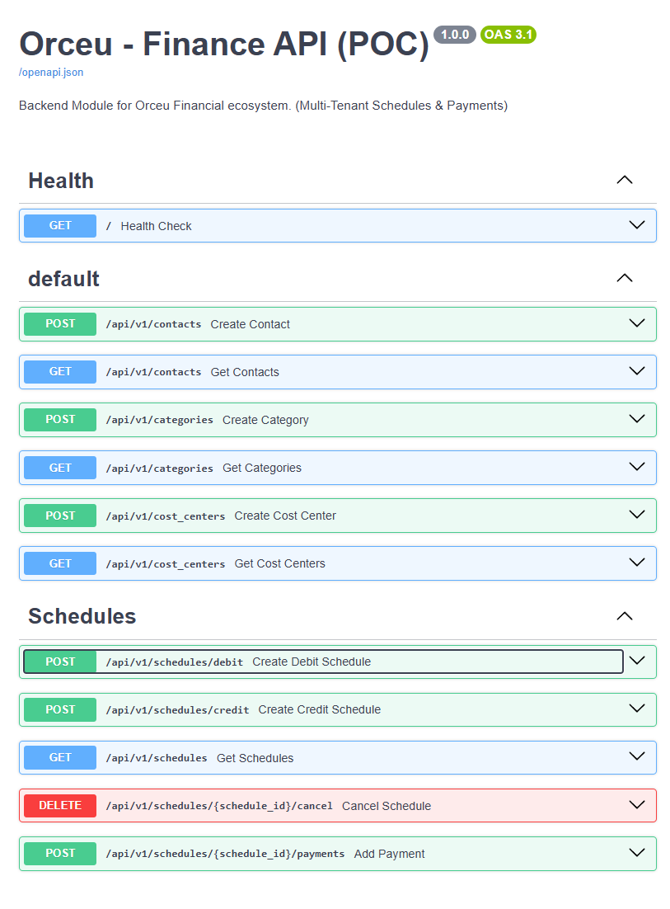

# [Orceu - Módulo Financeiro Backend (POC)](https://finance-orceu.onrender.com/docs) - ***[swagger-online](https://finance-orceu.onrender.com/docs)***

Esta é a Prova de Conceito (POC) para o Módulo Financeiro da Plataforma Orceu, com foco total no gerenciamento robusto de contas a pagar (Agendamentos / Schedules Debit) e receber (Credit). A solução adota Clean Architecture, Domain-Driven Design (DDD) e CQRS com tecnologias modernas.

---


---

## 🚀 Destaques do Projeto (Key Features)

*   **Nibo API Compliance:** Mimetismo arquitetural do ecossistema Nibo, utilizando padrões de nomenclatura e filtragem **OData** (`$top`, `$skip`, `$orderBy`).
*   **Domain Intelligence:** Regras de negócio protegidas no núcleo (Ex: Impedimento de sobre-pagamento e estorno de contas liquidadas).
*   **Virtual Status Engine:** Cálculo dinâmico de estados (`OPEN`, `PAID`, `OVERDUE`) sem redundância de dados no banco.
*   **Multi-tenant por Design:** Isolamento rigoroso de dados entre organizações via middleware de injeção de Tenant ID.
*   **Documentação Enterprise:** Swagger UI enriquecido com exemplos reais para teste instantâneo ("Try it out" ready).

## Stack Tecnológica

* **Linguagem**: Python 3.12+
* **Framework Web**: FastAPI
* **Banco de Dados Relacional**: PostgreSQL
* **Orquestração e Deploy**: Docker & Docker Compose
* **Manipulação e Migração de Dados**: SQLAlchemy & Alembic
* **Testes**: Pytest

---

## 🏃 Instruções para Execução

1. Certifique-se de ter o `Docker` instalado para o banco de dados e o `Python 3.12+`.
2. Clone este repositório e crie um ambiente virtual:
   ```bash
   python -m venv .venv
   .\.venv\Scripts\activate # (No Windows) ou: source .venv/bin/activate (Linux/Mac)
   pip install -r requirements.txt
   ```
3. Inicialize o contêiner do PostgreSQL na porta `5433` (configurada via docker para evitar conflitos no Host):
   ```bash
   docker-compose up -d db
   ```
4. Rode as migrações do banco de dados utilizando a ferramenta Alembic:
   ```bash
   alembic upgrade head
   ```
5. Popule o banco com o Tenant Zero e dados de teste:
   ```bash
   python scripts/seed_db.py
   # ID DA ORGANIZAÇÃO (Use no Header): 99999999-9999-4999-9999-999999999999
   ```
6. Inicialize a API localmente:
   ```bash
   python -m uvicorn app.main:app --host 0.0.0.0 --port 8000 --reload
   ```

### 🎮 Acessando e Testando a API (Swagger)

A página interativa oficial (Swagger UI) estará disponível em:
👉 **[http://localhost:8000/docs](http://localhost:8000/docs)**

> **COMO AUTENTICAR**: O sistema é estritamente Multi-Tenant. Clique no botão "Try it out" em qualquer Rota (ex: `GET /api/v1/contacts`) e **obrigatoriamente** preencha o campo de Header Parâmetro `x-organization-id` com o UUID `99999999-9999-4999-9999-999999999999` gerado no Seed. Sem esse Tenant ID, a API retorna erro 400.

#### 📝 Manual Prático (Fluxo Completo de Testes no Swagger)

Para testar todos os pontos chave do módulo utilizando o **Tenant ID: `99999999-9999-4999-9999-999999999999`**:

**Passo 1: Resgatar IDs do Domínio** 
Para criar contas, você precisa de um Contato (Favorecido), uma Categoria e um Centro de Custo.
- Acesse `GET /api/v1/contacts` e clique em *Execute*. Copie o `"id"` do fornecedor na listagem.
- Acesse `GET /api/v1/categories` e copie um `"id"` de categoria.
- Acesse `GET /api/v1/cost_centers` e copie o `"id"` da obra.

**Passo 2: Criar uma Obrigação Financeira (Schedules)**
- Abra a rota `POST /api/v1/schedules/debit`.
- Insira o Tenant ID no Header.
- No "Request body", insira o seguinte JSON substituindo os IDs pelos copiados no *Passo 1*:
```json
{
  "contact_id": "COLE_O_UUID_AQUI",
  "category_id": "COLE_O_UUID_AQUI",
  "cost_center_id": "COLE_O_UUID_AQUI",
  "description": "Fatura Mensal Cimento Portland",
  "value": 1500.00,
  "issue_date": "2026-04-01",
  "due_date": "2026-05-15"
}
```
- A API devolverá os dados gravados. Copie o `"id"` gerado na resposta da Schedule.

**Passo 3: Validando as Regras e Criando Pagamentos**
- Vá na rota `POST /api/v1/schedules/{schedule_id}/payments`.
- Coloque o Tenant ID no Header e cole o `"schedule_id"` copiado na etapa superior no campo "Path parameter".
- No "Request body", simule o abatimento da dívida parcialmente com um JSON:
```json
{
  "value_paid": 500.00,
  "payment_date": "2026-04-02",
  "receipt_document": "NSU-XPT09"
}
```
*Após Executar: Tente enviar esse mesmo `POST` mais 3 vezes e tente pagar R$ 1500 a mais... Note como o sistema (A camada de Domínio Pura Pydantic) barrará com erro `HTTP 400 Bad Request` indicando "Estouro Transacional".*

**Passo 4: Confirmando o Virtual Status**
- Se você acessar `GET /api/v1/schedules`, poderá visualizar a conta que antes estava como `"OPEN"`.
- Graças a regra em memória, se você pagou `1500.00`, a propriedade `"status"` do objeto virá como `"PAID"` sem nunca ter engessado uma string na tabela, prevenindo bugs concorrentes!

---

## 🌟 Nibo API Pattern Compliance

Para se assimilar da melhor maneira aos casos de uso reais que orquestram a engenharia financeira em grandes empresas, esta aplicação foi desenhada com alto acoplamento filosófico ao padrão Nibo API de integração:

* **OData Filtering & Pagination:** Assim como o Nibo oficial, adotamos os modelos restritos `$skip`, `$top` e `$orderBy` como os query parameters chave da API na camada FastAPI e convertemos matematicamente para atuar nos motores offset nativos relacional.
* **Schemas Representativos:** Padrões idênticos (`schedules/debit`, agrupadores, `CostCenters`) garantem flexibilidade no *frontend*.
* **Engenharia de Swagger Refinada:** Adotamos descritivos empresariais no `app.main` (tags ricas, Metadados Nibo) para uma imersão instantânea e visual mais condizente aos *Portfólios Cloud* onde esse micro-serviço pode ser deployado.

---

## 🏗️ Arquitetura e Lógica de Domínio

Foi decidido utilizar um Design Limpo (**Clean Architecture**) aliado a conceitos de **CQRS**.
Isso significa que o banco de dados é apenas um detalhe de infraestrutura e a API FastAPI atua unicamente como interface de entrega (*Delivery Mechanism*). O fluxo de criação cruza rigidamente estas camadas:
`Router (FastAPI) -> Command Handler (Aplicação) -> Domain Entities (Regras) -> Repository (Mapeamento SQLAlchemy)`.

### 🧠 Regra de Negócio: Anti-Estouro Transacional
Uma das partes essenciais brevemente explicadas nesta arquitetura é o controle financeiro inteligente na Entidade central `Schedule` (Agendamento financeiro a pagar/receber). 

Quando você tenta criar um "Pagamento" (`POST /schedules/{id}/payments`), a camada de Aplicação aciona a função de autorização diretamente na classe do Domínio: `schedule.can_receive_payment(amount)`.
Se um agendamento for de **R$ 10.00**, possuir amortizações anteriores de **R$ 8.00**, e tentar-se lançar um novo pagamento no valor de **R$ 5.00**... O Objeto de Domínio **nega a autorização imediatamente**. Não havendo necessidade de criar travas de banco via SQL, mas através de código purista, retornando um alerta direto e seguro: `"Estouro Transacional"`.

### 🛡️ Multi-Tenant e Isolamento de Dados
Para o escopo corporativo Multi-Tenant, simulamos no FastAPI um "Interpectador" (uma Dependência global) atrelada ao cabeçalho `x-organization-id`. O UUID desta organização desce de cima abaixo para todo "Repositório SQL" forçando uma injeção de trava de `WHERE organization_id = ID`. Com isso, NENHUM agendamento possivelmente "vazará" para outras construtoras, garantindo blindagem de dados vertical severa.

## 📁 Guias Aprofundados (Documentação) 

Para análise corporativa do teste técnico e engenharia formal, verifique a pasta [`/docs`](./docs/):
* 📖 [PRD - Product Requirements Document](./docs/PRD.md)
* ⚙️ [Technical Spec](./docs/Technical_Spec.md)
* 📋 [Plano de Execução](./docs/Execution_Plan.md)
* 🤖 [Desempenho Gen-AI (Usage)](./docs/AI_Usage.md)
* 📊 [Docs de testes](./docs/Tests_Documentation.md)
* 📑 [Guia de Testes Passo a Passo (POST payloads)](./docs/Test_Manual.md)

---

## ❓ Perguntas Obrigatórias do Teste Técnico

### 1. Quais foram os principais trade-offs da sua solução?
Para construir uma API concisa no contexto de uma "POC", optei por focar na entrega monolítica e fortemente tipada em Python ao invés de microserviços granulares puros com mensageria assíncrona. 
* **Trade-off 1 (Segurança):** Simulei a autenticação (OAUTH/JWT) por uma Injeção Simplificada de Headers. O isolamento de dados no DB é real (A Cláusula `WHERE organization_id = X` existe sempre no base repository acionado), porém sem Token validation, simplificando os testes.
* **Trade-off 2 (Validação de Status no Banco):** O Status ("open", "paid", "overdue") poderia rodar por Cronjob 1x por dia mudando campo nativo na tabela. Contudo, em favor de uma API com tempo real rigoroso, este dado pode ser validado como uma "Property Virtual".

### 2. O que você faria diferente em um ambiente de produção?
* **Mensageria**: Os comandos de inserção do *Payment*, num evento real, poderiam postar em um barramento (Kafka/SQS) comunicando o resto do Orceu que um saldo foi abatido, para reatividade de outros sistemas (estoque, folha de pagamento).
* **Banco de Dados (Read Replica):** Inseriria Read-Replicas no Postgres para escalonar Queries (CQRS) se descolando completamente do Banco de Write (Write Master / SQL Master).
* **Autenticação e CI/CD:** Uso massivo de CI no Github actions e deploy por Terraform. Validação total via Identity Provider (ex: AWS Cognito, Auth0) usando `claim` de token para capturar o `X-Organization-ID` sem chance de spoofing do Client.

### 3. Como sua arquitetura evoluiria para suportar:

**A) Fluxo de Caixa Consolidado (Dashboards de Alta Performance)**
Na POC atual, listamos os `Schedules` (agendamentos) de forma pontual. Para um Fluxo Consolidado (visão diária/mensal de caixa), a evolução natural seria a implementação de **Read Models otimizados** via CQRS.
*   **Técnica:** Utilizaríamos `Materialized Views` no Postgres ou uma tabela de agregação dedicada.
*   **Por que?** Dashboards não podem realizar "Cálculos Pesados" (Soma/Média) em milhões de linhas a cada atualização de página. Pré-consolidar esses valores por dia e categoria garante uma resposta em milissegundos, transformando a API em um motor de inteligência financeira escalável.

**B) Conciliação Bancária (Integração e Automação)**
Para automatizar a baixa de títulos, introduziríamos um módulo de **Bank Integration** via Open Banking ou processadores de arquivos (OFX/CNAB).
*   **Técnica:** Implementaríamos uma **ACL (Anti-Corruption Layer)** para isolar o nosso Domínio dos dados "sujos" e variados vindos de diferentes bancos. 
*   **Lógica:** Um **Matching Engine** compararia o "Valor, Data e Favorecido" do extrato bancário contra os nossos `Schedules`. Ao encontrar uma coincidência (acima de 98% de score), o sistema dispararia automaticamente o comando de `Payment`, mudando o status da conta para "Liquidado" sem intervenção humana.

**C) Múltiplas Obras e Hierarquias (Escalabilidade de Acesso)**
Atualmente, o isolamento é feito por `OrganizationID`. Para suportar múltiplas obras ou filiais de forma granular, evoluiríamos para um modelo de **Hierarquia de Centros de Custo**.
*   **Técnica:** Implementação de **RBAC (Role-Based Access Control)**.
*   **Cenário Real:** Uma grande construtora tem 10 obras. O Engenheiro A só pode ver os custos da "Obra Solar", enquanto o Diretor Financeiro vê o consolidado de todas. O banco de dados Postgres, que já utiliza `CostCenterID`, facilitaria essa trava lógica. Bastaria associar o `UserID` aos Centros de Custo permitidos, garantindo que ninguém acesse dados financeiros de projetos alheios.
