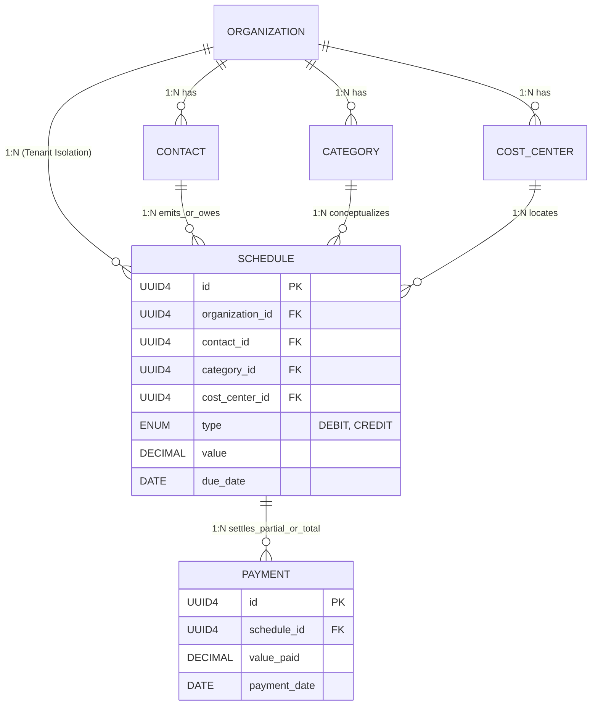

# Arquitetura de Entidades e Relacionamentos Bancários (ER)
**Projeto**: Orceu - Módulo Financeiro Backend
**Escopo**: Design Estrutural Relacional (PostgreSQL)

Este documento centraliza as definições do esquema do banco de dados relacional e do domínio (DDD), expondo chaves primárias (PK), chaves estrangeiras (FK), tipagem e multiplicidade dos relacionamentos.

---

## 1. Dicionário de Entidades Core

### 1.1 `organizations` (Tenant/Clientes do Orceu)
A entidade mestre. Todas as outras tabelas sofrem Forte Dependência Identificadora dessa entidade, garantindo um sistema **Multi-Tenant rigoroso**. Nenhuma query pode ocorrer sem referenciar esta matriz.
* **PK:** `id` (UUIDv4)
* `name` (VARCHAR 255, Not Null)
* `tax_id` (VARCHAR 20, Unique) - *CNPJ ou CPF*
* `created_at` (TIMESTAMP)

### 1.2 `contacts` (Fornecedores / Clientes emissores)
Ator que origina uma obrigação ou que recebe o crédito.
* **PK:** `id` (UUIDv4)
* **FK:** `organization_id` (UUIDv4) -> Ref `organizations.id` (On Delete CASCADE)
* `name` (VARCHAR 255, Not Null)
* `document_number` (VARCHAR 20, Nullable) - *CPF/CNPJ do terceiro*
* `email` (VARCHAR 255, Nullable)

### 1.3 `categories` (Plano de Contas)
Classificador de natureza financeira determinando se o agendamento é recebimento (Credit) ou despesa (Debit).
* **PK:** `id` (UUIDv4)
* **FK:** `organization_id` (UUIDv4) -> Ref `organizations.id` (On Delete CASCADE)
* `name` (VARCHAR 100, Not Null) - *Ex: Material de Construção, Mão de Obra*

### 1.4 `cost_centers` (Centros de Custo / Obras)
Hub físico/lógico onde o dinheiro está sendo gasto/pago. Essencial para totalização orçamentária.
* **PK:** `id` (UUIDv4)
* **FK:** `organization_id` (UUIDv4) -> Ref `organizations.id` (On Delete CASCADE)
* `name` (VARCHAR 100, Not Null) - *Ex: Obra Edifício Vivaldi*

### 1.5 `schedules` (Agendamentos Financeiros)
O núcleo da aplicação. Representa a **obrigação (A Pagar)** ou o **direito (A Receber)**. Agrega categorias, centros de custo e o valor devido estipulado no passado.
* **PK:** `id` (UUIDv4)
* **FK 1:** `organization_id` (UUIDv4) -> Ref `organizations.id` (On Delete CASCADE)
* **FK 2:** `contact_id` (UUIDv4) -> Ref `contacts.id` (On Delete RESTRICT)
* **FK 3:** `category_id` (UUIDv4) -> Ref `categories.id` (On Delete RESTRICT)
* **FK 4:** `cost_center_id` (UUIDv4) -> Ref `cost_centers.id` (On Delete RESTRICT)
* `type` (ENUM: 'DEBIT', 'CREDIT')
* `description` (VARCHAR 255)
* `value` (DECIMAL 15,2, Not Null) - *Valor total do agendamento*
* `issue_date` (DATE) - *Data oficial da emissão da nota*
* `due_date` (DATE, Not Null) - *Data limite/vencimento*
* `created_at` (TIMESTAMP)

### 1.6 `payments` (Execuções Financeiras Transacionais)
Representa a contra-partida real de um Schedule. Múltiplos pagamentos podem existir (pagamentos parciais) para abater o `value` de um Schedule isolado.
* **PK:** `id` (UUIDv4)
* **FK 1:** `organization_id` (UUIDv4) -> Ref `organizations.id` (On Delete CASCADE)
* **FK 2:** `schedule_id` (UUIDv4) -> Ref `schedules.id` (On Delete RESTRICT)
* `value_paid` (DECIMAL 15,2, Not Null) - *Quanto foi pago/recebido*
* `payment_date` (DATE, Not Null) - *Quando a efetivação ocorreu no mundo real*
* `receipt_document` (VARCHAR 255, Nullable) - *Nº do comprovante bancário*
* `created_at` (TIMESTAMP)

---

## 2. Mapa de Relacionamentos (Multiplicidades)

* `Organization` possui **(1:N)** `Contacts`
* `Organization` possui **(1:N)** `Categories`
* `Organization` possui **(1:N)** `CostCenters`
* `Organization` possui **(1:N)** `Schedules`
* `Contact` atua em **(1:N)** `Schedules` *(um empreiteiro pode emitir N notas)*
* `Category` cataloga **(1:N)** `Schedules`
* `CostCenter` concentra **(1:N)** `Schedules`
* `Schedule` recebe **(1:N)** `Payments` *(um boleto gigante pode ser pago em três depósitos distintos)*

### Diagrama Entidade-Relacionamento

---

## 3. Invariantes Rígidas (Business Rules para banco)

* **Impeditivo de Estouro Transacional**: A soma vetorial matemática dos valores em `value_paid` da tabela `payments` agrupados por um `schedule_id` específico **jamais** poderá ser matematicamente superior ao campo `value` da mesma tupla em `schedules`. Esta validação será tratada na Camada de Aplicação do CQRS (Clean Architecture).
* **Property de Status (Virtual / Calculado)**: O banco em si não deterá uma string engessada `'PAID'` ou `'OVERDUE'`. Isso evita inconsistências no momento do update temporal. O Status é gerado dinamicamente:
    * Se `SUM(payments.value_paid) == schedules.value` $\rightarrow$ **PAID**
    * Se `SUM(payments.value_paid) < schedules.value` e `hoje() > due_date` $\rightarrow$ **OVERDUE**
    * Se `SUM(payments.value_paid) < schedules.value` e `hoje() <= due_date` $\rightarrow$ **OPEN**
* **Strict Deletion Rule**: Se o `Schedule` possui a flag *virtual* **PAID**, o comando CQRS de Delete da Entidade é bloqueado pela camada de Domínio. Além disso, as foreign keys operam com regra **RESTRICT** para `contact`, `category` e `cost_center` afim de garantir a malha fiscal íntegra caso hajam agendamentos. Apenas um apagamento total do `organization_id` operará limpa total usando o DB CASCADE.
