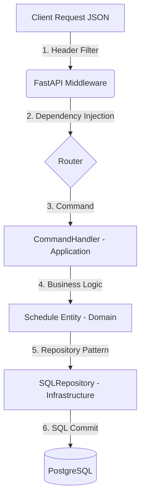

# Technical Spec - Especificação Técnica
**Projeto**: Orceu - Módulo Financeiro
**Iniciativa**: POC (Proof of Concept) Backend

---

## 1. Arquitetura

O sistema será construído usando a metodologia **Clean Architecture** (Arquitetura Limpa), guiada pelos princípios do **Domain-Driven Design (DDD)** e segregada nas transações de leitura/escrita com o padrão **CQRS (Command-Query Responsibility Segregation)**. A infraestrutura e persistência das informações ficará centralizada em um banco relacional utilizando **PostgreSQL**. A API será disponibilizada em formato RESTful usando **FastAPI**.

### Adoção de Clean Architecture
As responsabilidades do projeto serão modularizadas em camadas (da mais isolada/interna para a mais dependente/externa):

1. **Domain Layer (Domínio)**
   - Coração da aplicação.
   - Entidades e Value Objects sem nenhuma instrução técnica atrelada (e.g. Models limpos do Nibo adaptados).
   - Abstração (Interfaces/Protocolos) dos repositórios.
   - Encapta regras de negócio e limites de operações (exemplo: não ultrapassar saldo).

2. **Application Layer (Aplicação/Casos de Uso)**
   - Orquestra os Fluxos da Aplicação e regra de fluxo (Use Cases).
   - Divide-se no padrão **CQRS**:
     - `Commands/Handlers`: Rotas mutáveis (`POST`/`PUT`/`DELETE`). Efetuam regras rígidas no repositório de gravação do banco e acionam Eventos (caso necessário).
     - `Queries/Handlers`: Rotas informativas (`GET`). Ignoram as entidades do domínio ricas e geram consultas otimizadas diretamente para DTOs na leitura (alta performance).

3. **Infrastructure Layer (Infraestrutura)**
   - Código que fala com o exterior.
   - Repositórios concretos do banco de dados relacional (`SQLAlchemy`).
   - Módulos de migração com `Alembic`.
   - Setup de orquestração com Docker.

4. **Presentation/Interface Layer (Interface)**
   - API de entrada. Controladores.
   - O framework escolhido (**FastAPI**) atuando como servidor de rotas, dependências, middleware Multi-tenant e Pydantic para Schemas/Validações de Payload REST.

---

## 2. Decisões Técnicas & Trade-offs

* **PostgreSQL Native (Dockerizado):** Melhor suporte a ACID compliance do mercado. O uso de Docker facilita controle de versão local.
* **Separation by Organization Header:** Em prol da agilidade estipulada para a POC e alinhamento do Multi-tenant (isolamento radical de dados), um `Header: x-organization-id` será estritamente validado na `Dependency Injection` do FastAPI, anexando o `tenant_id` atual para todos os Casos de Uso que a requisição tocar, garantindo impossibilidade de misturar agendamentos. Em prd, utilizaríamos claims de JWT.
* **Date Based Status Calculation:** O status de um agendamento ("open", "paid", "overdue") poderia ser mantido via triggers assíncronos de banco. Decidimos usar cálculo DTO ou Query Dinâmica para a leitura: Se a `Due_Date` já passou de `hoje` e o total pago é inferior ao valor do agendamento, o retorno para o client será dinamicamente `"overdue"`.
* **Idempotência (Diferencial):** Ao criar pagamentos parciais transacionais críticos, haverá validação contra redundâncias lógicas nativas pelo FastAPI e `IntegrityError` do SQLAlchemy no mesmo instante temporal.
* **UUIDv4 vs Auto-increment:** Para o banco principal, as PKs serão expostas nas URIs REST como UUID (string) impossibilitando navegação dedutiva de agendamento por ID incremental, melhorando segurança.

---

## 3. Modelagem de Dados e Entidades (Domain Entities)

Os conceitos foram extraídos a partir da estrutura API corporativa base estabelecida pelo Nibo, transmutada para o vocabulário Orceu Construção Civil.

### Entidades Core:

1. `Organization`: (Tenant)
   - *Atributos:* `organization_id(UUID)`, `name`, `tax_id` (CNPJ/CPF).

2. `Contact`: (Terceiros: Empreiteiros, Clientes, Fornecedores)
   - *Atributos:* `contact_id`, `organization_id`, `name`, `cpf_cnpj`, `email`.

3. `Category`: (Plano de Contas/Classificação Orçamentária)
   - *Atributos:* `category_id`, `organization_id`, `name` (Ex: "Material Elétrico", "Cimento"), `type` (Credit/Debit).

4. `CostCenter`: (Centro de Custo / Obras)
   - *Atributos:* `cost_center_id`, `organization_id`, `name` (Ex: "Obra Edifício Alfa - Setor B").

5. `Schedule` (Debit / Credit) - (Agendamento de Conta)
   - *Atributos:* `schedule_id(UUID)`, `organization_id`, `contact_id`, `category_id`, `cost_center_id`.
   - *Dados Financeiros:* `reference`: string, `value`: Decimal, `type`: enum(CREDIT, DEBIT).
   - *Temporalidade:* `issue_date` (Emissão), `due_date` (Vencimento).
   - *Sumarizações Virtuais:* `amount_paid` (Dinâmico), `status` (OPEN, OVERDUE, PAID).

6. `Payment` - (Pagamentos/Recebimentos transacionais efetivos)
   - *Atributos:* `payment_id`, `schedule_id`, `organization_id`, `value_paid`: Decimal, `payment_date`: Date, `receipt_document`: string (nota de comprovante).

### Relacionamentos Invariantes:
- Todo `Schedule`, `Contact`, `CostCenter`, e `Category` obrigatoriamente se remete a **1 e 1** `Organization`. (FK Restritiva).
- Um `Schedule` possui **1 e 1** `Category`, `CostCenter` e `Contact` (não podem ser nulos no Orceu - Restrição Forte).
- Um `Schedule` pode ter **N** `Payments`. (Relação 1:N). O saldo estipulado no Schedule (`value`) deve ser maior ou igual a SOMATÓRIA dos `values_paid` registrados (Regra de Negócio Pura).

---

---

## 5. Implementações de Destaque (Deep Dive Técnico)

Nesta seção, detalhamos os trechos de código que sustentam a robustez do Orceu Financeiro.

### 5.1. Isolamento Multi-tenant (Segurança por Design)
Para garantir que os dados de uma construtora jamais vazem para outra, utilizamos **Dependency Injection** do FastAPI para capturar o ID da organização diretamente do Header.

```python
# Arquivo: app/presentation/dependencies.py
async def get_organization_id(x_organization_id: str = Header(...)) -> uuid.UUID:
    """
    Simula a extração de tenant de um token JWT.
    Injeta o organization_id em todas as rotas e repositórios.
    """
    try:
        return uuid.UUID(x_organization_id)
    except ValueError:
        raise HTTPException(status_code=400, detail="Invalid Organization ID.")
```

### 5.2. Domínio Rico: Status Virtual & Validação (DDD)
Diferente de sistemas CRUD tradicionais, o status de uma conta não é um campo estático no banco. Ele é calculado em tempo real, garantindo integridade total.

```python
# Arquivo: app/domain/entities.py
class Schedule(DomainEntity):
    @property
    def status(self) -> ScheduleStatus:
        if self.total_paid >= self.value:
            return ScheduleStatus.PAID
        if date.today() > self.due_date:
            return ScheduleStatus.OVERDUE
        return ScheduleStatus.OPEN

    def can_receive_payment(self, amount: Decimal) -> bool:
        """Regra de Ouro: Impede que o sistema receba pagamentos que excedam o valor original."""
        return (self.total_paid + amount) <= self.value
```

### 5.3. CQRS: Separação de Comandos e Consultas
O sistema separa as operações de escrita (Commands) das operações de leitura (Queries). Isso permite otimizar a performance de relatórios sem complicar a lógica de gravação.

*   **Commands**: Processam regras de negócio e alteram o estado (ex: `add_payment`).
*   **Queries**: Focadas em leitura rápida e filtros complexos (ex: `get_schedule_summary`).

### 5.4. OData Compliance & Filtragem Bi (Infraestrutura)
A camada de infraestrutura traduz os parâmetros OData (`$top`, `$skip`, `$orderBy`) para SQL dinâmico usando SQLAlchemy. Além disso, o endpoint de `/summary` já suporta filtros avançados por Categoria e Centro de Custo.

```python
# Arquivo: app/infrastructure/repositories.py
def get_summary(self, org_id, due_date_from, due_date_to, category_id, ...):
    query = self.session.query(models.Schedule).filter(models.Schedule.organization_id == org_id)
    
    # Filtros Dinâmicos de BI
    if due_date_from: query = query.filter(models.Schedule.due_date >= due_date_from)
    if category_id: query = query.filter(models.Schedule.category_id == category_id)
    
    # ...agregação dos totais em memória para garantir o status dinâmico correto...
```

---

## 6. Ciclo de Vida de uma Requisição (Rastreabilidade)

Nesta seção, mapeamos como uma requisição "atravessa" as camadas da aplicação, demonstrando o desacoplamento e a separação de responsabilidades.

### 6.1. Fluxo de Execução (Diagrama de Camadas)

O fluxo abaixo ilustra o caminho de um comando de escrita (POST):



### 6.2. Mapeamento de Funcionalidades por Camada

A tabela abaixo relaciona os principais endpoints com as regras de negócio e infraestrutura envolvidas:

| Endpoint | Interface (Presentation) | Lógica (Application/CQRS) | Regra de Domínio (Business Logic) | Persistência (Infrastructure) |
| :--- | :--- | :--- | :--- | :--- |
| `POST /contacts` | `basics.create_contact` | `CommandHandler.create_contact` | Validação de Schema (Pydantic) | `SQLContactRepository` |
| `POST /schedules/debit` | `schedules.create_debit` | `CommandHandler.create_schedule` | Status inicial `OPEN` | `SQLScheduleRepository` |
| `POST /payments` | `schedules.add_payment` | `CommandHandler.add_payment` | `Schedule.can_receive_payment` | `SQLPaymentRepository` |
| `DELETE /cancel` | `schedules.cancel_schedule` | `CommandHandler.cancel_schedule` | `Schedule.status != PAID` | `SQLScheduleRepository` |
| `GET /summary` | `schedules.get_summary` | `QueryHandler.get_summary` | Cálculos de Agregação / BI | `SQLScheduleRepository` |
| `GET /detailed` | `schedules.get_detailed` | `QueryHandler.get_schedules` | Filtragem Dinâmica OData | `SQLScheduleRepository` |

### 6.3. O Fluxo de Leitura (Queries) vs Escrita (Commands)

Seguindo o padrão **CQRS**, as leituras (`GET /summary`, `GET /detailed`) são otimizadas. Elas não carregam a complexidade de transações de estado da entidade, focando apenas em performance e filtragem dinâmica. 

As escritas, por outro lado, são **transacionalmente seguras**. Um pagamento (`POST /payments`) nunca é gravado sem que o objeto do Domínio (`Schedule`) valide se o saldo é suficiente, protegendo a integridade dos dados antes mesmo de tocar no SQL.

---

## 7. Conclusão e Evolução

Esta arquitetura foi desenhada para escalar. O uso de **Clean Architecture** permite que a aplicação cresça para um sistema ERP completo com segurança e testabilidade total. 🚀
